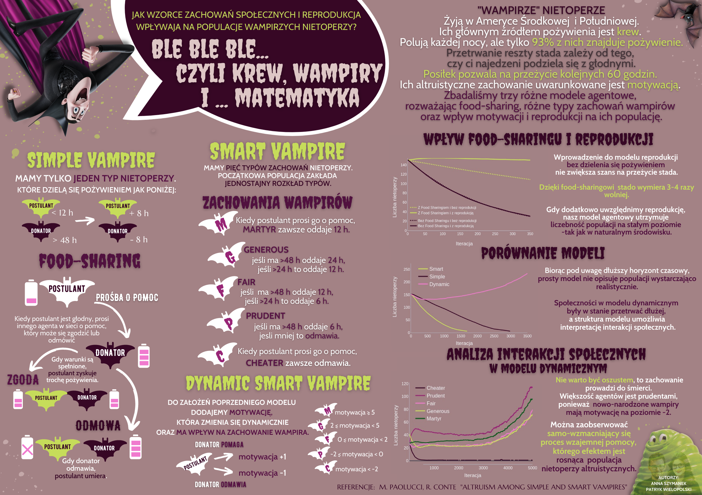

# How do things like social behavior patterns and reproduction affect the vampire bat population? 

## What is vampire?
Vampire bats - live in Central and South America. 
Their main food source is blood.  They hunt during the night,  but only 93% of the community will come back full.
The survival of the rest of the herd depends on whether the former will share food with them. With this meal, they can live another 60 hours, such altruistic behavior is conditioned by their motivation.  

## What is the agent model?

Agent-Based models are simulation models based on creating agents that make spatial decisions. They are also able to exchange information with each other. Moreover, they have attributes that make it possible to determine their current state. In the classical modelling approach, all elements of the model are equal. In an agent model, agents can be created that are similar or identical in structure and have completely different behaviour and decision rules. This allows an element of randomness to be introduced into the model, which is important in naturalistic research. 

## What models we have implemented?

We have models with three different agents:
1. Simple vampire:
2. Smart vampire
3. Smart dynamic vampire

## What we use?

In our project we use Mesa, this is an Apache2 licensed agent-based modeling framework in Python.

It allows users to quickly create agent-based models using built-in core components (such as spatial grids and agent schedulers) or customized implementations; visualize them using a browser-based interface; and analyze their results using Python's data analysis tools. Its goal is to be the Python 3-based alternative to NetLogo, Repast, or MASON.

#### Implementation of the agent model based on on the article: M. Paolucci, R. Conte "Altruism among Simple and Smart Vampires".

